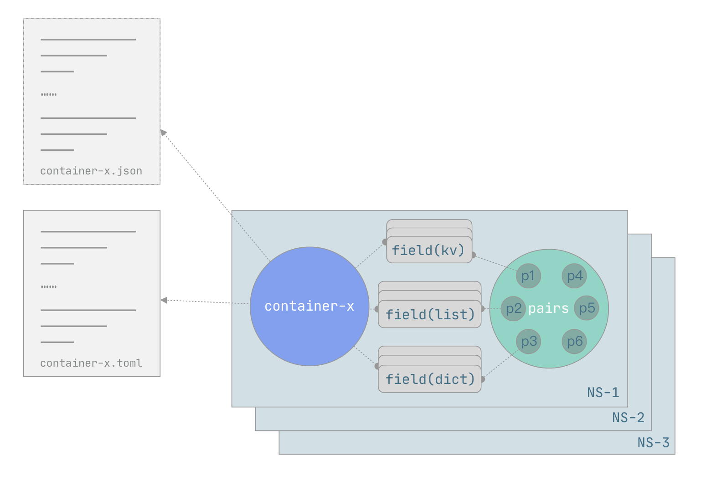
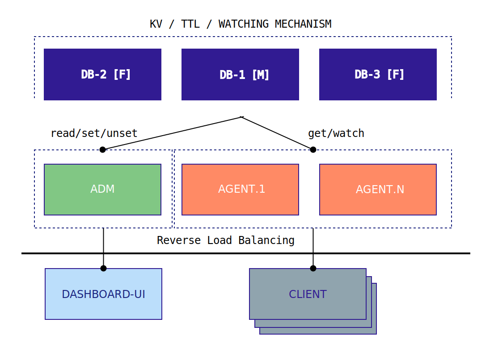

# cassem
 

config assembler from key-value pairs' container which include basic datatypes, such as int, string, float, bool, list, dict

## Features

- [x] HTTP Restful API.
- [x] Export container (config container) into different file format (JSON / TOML).
- [ ] Manage `CTL` / `UI` support.
- [x] Master / Slave architecture support based raft (only write on master).
  - [x] Master / Slave architecture and only allow to write on master.
  - [x] Slave need to forward request to master.
- [x] RESTful API permission control.
- [x] `Changes` watching and notifying.
  - [x] Watcher component.
  - [x] Watcher Server.
  - [x] Client SDK support.
- [x] Distributed `Cache` middleware to speed up the API which downloads container in specified format. 

## [Documentation](./docs/README.md)

### - [cassemctl](./cmd/cassemctl/README.md)

### - [cassemd](./cmd/cassemd/README.md)

## Benchmark

benchmark tested core RESTful API and try to optimize them, each benchmark test displays the final QPS result. 

[README](./benchmark/README.md)

## References

* https://github.com/yongman/leto
* https://github.com/laohanlinux/riot
