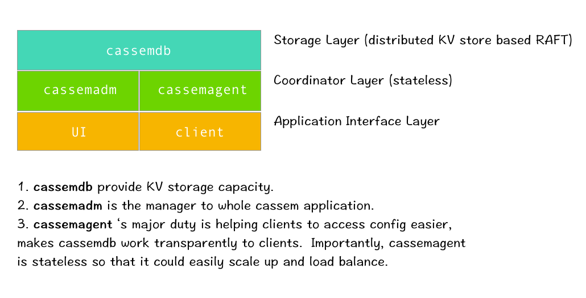
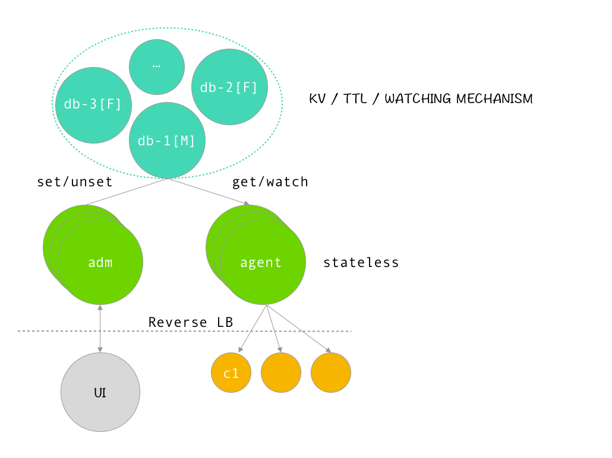

# cassem
 

`CASSEM` is a distributed config management center, it is totally independent, so it's easy to deploy and maintain in your environment. At the
same time, it's deployed by `Go` which gives it platform-cross ability and fast-compile.

## Features

- [x] HTTP Restful API to manage all configs `cassemadm`.
  - [x] Stateless so that it can be easily scaled.
  - [ ] Gray released.
  - [x] Multi-version management.
  - [ ] Operation log, each operation to config elements will be recorded.
  - [ ] Permission control.
  - [ ] Client instance management.
  - [ ] `CTL` / `UI` tool support these are constructing on `cassemadm` RESTful API.
    - [ ] [Web UI](https://github.com/yeqown/cassem-ui) is developing.
    - [ ] [CTL](#) tool to debug and manage config from terminal. 
- [x] Distributed storage component `cassemdb`, based on raft consensus algorithm.
  - [x] Master can read and write.
  - [x] Slave node can only respond to read request.
  - [x] Use `gRPC` protocol to communicate.
  - [x] `Watch` `TTL` features support.
- [ ] Stateless agent component `cassemagent` to improve client's usability.
  - [ ] Cache config elements, and using `LRU-K` replacing algorithm.
  - [ ] Language independent support `HTTP` and `gRPC` protocol.
  - [ ] Client SDK, easy to use.
  - [ ] `Change Push` ability, gray released also built on this.

## [Documentation](./docs/README.md)

### - [cassemdb](./cmd/cassemdb/README.md)

### - [cassemadm](cmd/cassemadm/README.md)

### - [cassemagent](cmd/cassemagent/README.md)

## [Benchmark](./benchmark)

benchmark tested core RESTful API and try to optimize them, each benchmark test displays the final QPS result. 

## References

* https://github.com/yongman/leto
* https://github.com/laohanlinux/riot
