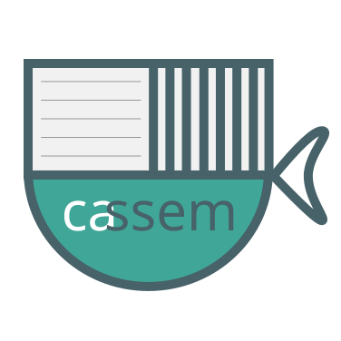
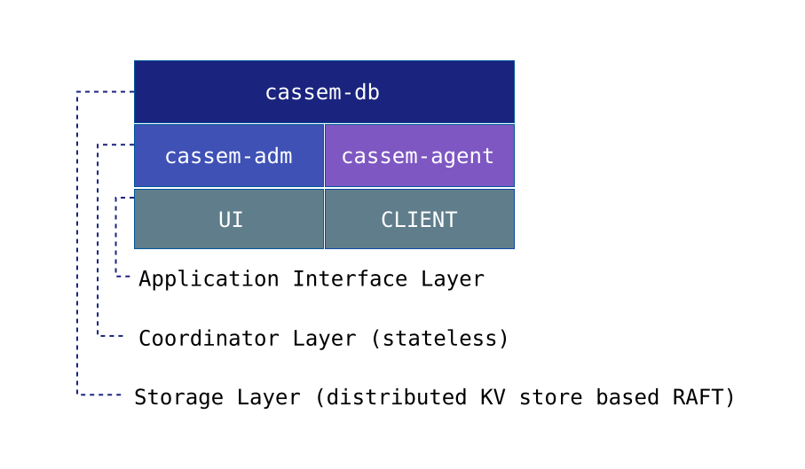
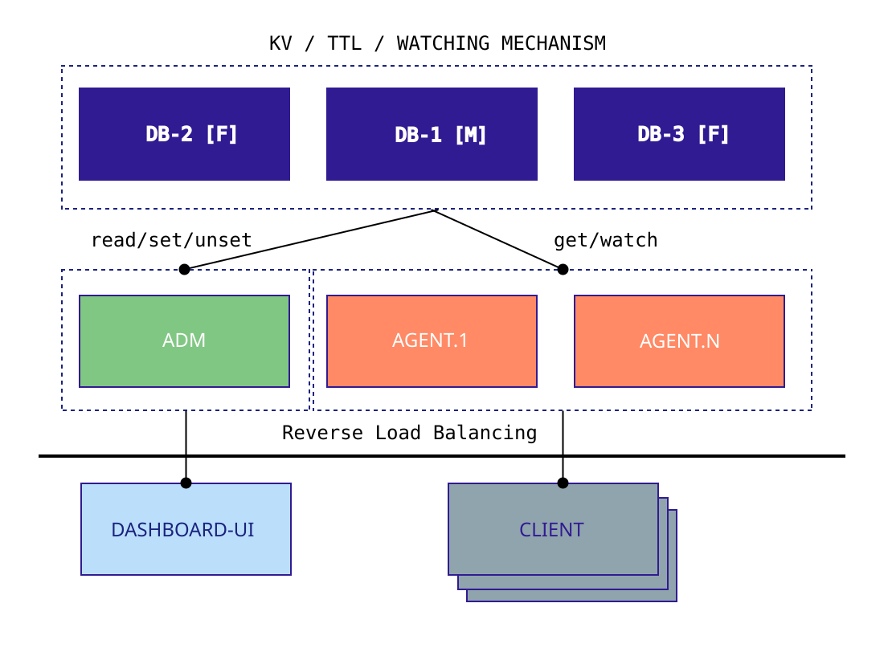
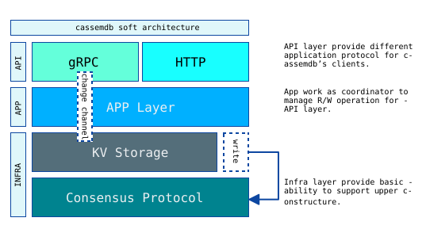

# cassem

<p align="center">
  
</p>

[](https://goreportcard.com/report/github.com/yeqown/cassem) [](https://pkg.go.dev/github.com/yeqown/cassem)

`CASSEM` is a distributed config management center, it is totally independent, so it's easy to deploy and maintain in your environment. At the
same time, it's deployed by `Go` which gives it platform-cross ability and fast-compile.


## Features

- [x] HTTP Restful API to manage all configs `cassemadm`.
  - [x] Stateless so that it can be easily scaled.
  - [x] Gray released.
  - [x] Multi-version management.
  - [ ] Operation log, each operation to config elements will be recorded.
  - [x] Permission control.
  - [x] Client instance management.
  - [ ] `CTL` / `UI` tool support these are constructing on `cassemadm` RESTful API.
    - [ ] [Web UI](https://github.com/yeqown/cassem-ui) is developing.
    - [ ] [CTL](#) tool to debug and manage config from terminal. 
  - [ ] OpenTelemetry metrics support
- [x] Distributed storage component `cassemdb`, based on raft consensus algorithm.
  - [x] Master can read and write.
  - [x] Slave node can only respond to read request.
  - [x] Use `gRPC` protocol to communicate.
  - [x] `Watch` `TTL` features support.
  - [ ] `Lazy Deletion` the expired KV. There is a deleting working thread to delete KV from queue, the queue's data is from
  - [ ] OpenTelemetry metrics support
  two part, one is `operation check`, another is `timer check`.
- [x] Stateless agent component `cassemagent` to improve client's usability.
  - [x] Cache config elements, and using `LRU-K` replacing algorithm.
  - [ ] Language independent support `HTTP` and `gRPC` protocol.
  - [x] Client SDK, easy to use.
  - [x] `Change Push` ability, gray released also built on this.
  - [ ] OpenTelemetry metrics support

- [ ] Fully test cases.
- [ ] One-liner deploy sh script.
- [x] Docker Compose deploy YAML script.
- [ ] GitHub CI Actions automate.

## [Documentation](./docs/README.md)



Explanation: 
- **_cassemdb_** provide KV storage capacity. 
- **_cassemadm_** is the manager to whole cassem application. 
- **_cassemagent_**‘s major duty is helping clients to access config easier,
   makes cassemdb work transparently to clients.  Importantly, cassemagent
   is stateless so that it could easily scale up and load balance.



### - [cassemdb](./cmd/cassemdb/README.md)

The KV storage component in cassem, provide gRPC API.



### - [cassemadm](cmd/cassemadm/README.md)

The manager in cassem, provide RESTful API to communicate. It is serving for CTL and Dashboard UI.

### - [cassemagent](cmd/cassemagent/README.md)

Agent is serving for user's client, agent SDK, actually. Of course, agent is stateless server.

## Local Cluster

The local full-cluster workflow uses Compose from [`examples/compose.cluster.yaml`](./examples/compose.cluster.yaml). The Makefile exposes `build-image`, cluster lifecycle, and quality-check entrypoints. `build-image` writes Linux binaries to ignored `bin/` before building local images.

```bash
make cluster.start
make cluster.status
make cluster.logs
make cluster.stop
make cluster.clean
```

The cluster script uses Podman Compose by default. Use `CONTAINER_TOOL=docker make cluster.start` to run the same workflow with Docker Compose.

### Integration release gate

Run the full local release gate with a clean Compose cluster:

```bash
make test.integration.cluster
```

This target builds Web assets and Linux binaries, builds local images, starts the example Compose cluster, waits for cassemdb/cassemadm/cassemagent readiness, runs integration tests in strict mode, prints logs on failure, and removes containers/volumes afterward.

Docker users can override the default Podman runtime:

```bash
CONTAINER_TOOL=docker make test.integration.cluster
```

Use the same `IMAGE_TAG` when starting a cluster manually:

```bash
IMAGE_TAG=dev-gate make cluster.start
make cluster.clean
```

## Web UI Development

The embedded admin UI source lives in [`web`](./web). For local Web UI development, run the Vite dev server on its own `IP:PORT` and proxy `/api` requests to `cassemadm` instead of relying on embedded `/ui/` serving.

```bash
make ui.install
CASSEMADM_API_TARGET=http://127.0.0.1:20218 npm run dev --prefix web -- --port 4173
```

Then open `http://<your-ip>:4173/` for the standalone dev UI. If you started the local cluster with `make cluster.start`, the default admin API target is `http://127.0.0.1:20218`.

Production and local image builds still use embedded assets under `/ui/` through `make ui.build` and `make cluster.start`.

## Tests and Benchmark

- Unit tests: `make test`
- Vet: `make vet`
- Lint: `make lint`
- Integration tests: `make test.integration.cluster`
- Local benchmarks: `go test -bench=. -benchmem ./tests/benchmark`
- Integration benchmarks: `go test -tags integration -bench=. -benchmem ./tests/benchmark`

Benchmarks live in [`tests/benchmark`](./tests/benchmark) and use Go benchmark code instead of shell scripts or external load-testing tools.

## References

* https://github.com/yongman/leto
* https://github.com/laohanlinux/riot
